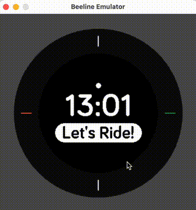
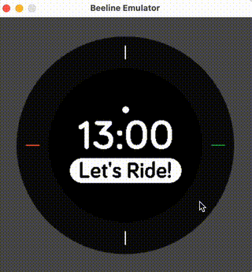

# Beeline Firmware Tech Challenge 

Welcome! We are looking forward to learning more about you and what you can bring to Beeline. For this, we would like you to work through this challenge in preparation for a technical interview. 

The challenge consists of two parts:
1. Get set-up, clone repository, install pre-reqs, compile the code, run it.
2. Add a short animation

We hope this will not take up too much of your time. Please do not submit anything, just be ready to share your screen with your solution during the interview. We do not care what tools / IDE / environment you use. 

## Components
The c/cpp code is a simplified subsection of firmware currently running on our Velo 2 product. The code is compiled into a native library loaded by python's ctypes. The c/cpp code manipulates a framebuffer which is displayed by a GUI using Python's pygame.

### app
`velo2_home.cpp` - This is the file we want you to understand and do your work in. Please do not edit other files in the app directory. 

### app/src/graphics
Contains subroutines for fonts, circles, lines, and other primitive rendering. We do not expect you to dig into these or understand how they work.

### app/src/drivers
Contains dummy drivers. On real hardware, these would interact with the SDK and the chip. In the native scenario here they are simple and don't interact with hardware. Have a look through them, it is all very straight forward.

### emulator/
Contains glue interface code and the Makefile to build the project. 

# Part 1. Compile & set up

For reference, this is what the Velo 2 home screen looks like for new users:

## Objective
We want you to get to a stage where you run

~~~
python emulator.py 
~~~ 
And get this outcome:

The state changes between connected / not connected when clicking on the window. 
### Clone
~~~
git clone <repository url>
~~~

### Prerequisits
The project requires a compiler, make, and python. If you are on linux, getting a recent version of GCC, GNU make, and python/pip should do. You'll need to run `pip install -r requirements.txt` to get pygame & numpy. There are more detailed instructions for [Mac](docs/installation_mac.md) and [Windows](docs/installation_windows.md). 

### Compiling
Running `make PLATFORM=MACOS` (or equivalent) in the emulator directory should create a libbeeline library in the emulator/build directory. Look at `emulator/Makefile` for reference.

### Running
Running `python emulator.py` should re-compile the library and then run the emulator. You might have to adjust the build commands in `emulator.py` for your platform to make this work. 

# Part 2. Add easeInOut animation

## Objective
Edit `velo2_home.cpp` to add an animation when the connected state changes. Instead of jumping instantly between the two states, we want the moveable objects to slide up and down and the "yellow pretend phone icon circle" to appear only when the animation is finished. The animation should be "Ease-in-out-cubic" as defined by [Easings.net](https://easings.net/#easeInOutCubic) and run over 500ms. Do not edit any other file in app/.

Use this as a reference as to what we are looking for.

Please keep the following in mind:
- Velo2 runs on a cortex m4 with FPU. Floats are fine, a couple of floating point operations are insignificant compared to all the rendering. 
- Cpp is ok but we don't use exceptions / heap based STL containers.
- Designers might want to use a different animation function down the line.
- The core logic of animating something might be useful in other parts of the fw. However, bear in mind that we believe in keeping it simple and to not engineer for yet unknown requirements. 

## Using LLMs / AI / Copilot / ChatGPT
We don't care how you work or what tools you use to be effective. Of course, we want you to understand the code you produce. For reference, Mark and Tim have used VSCode+CoPilot for ~1.5 years and Charlie has been trialing Cursor recently. We've had good success when converting standalone code between languages (eg Python -> Kotlin) using LLMs and generally think that these tools can be useful. However, we don't think humans will be replaced by AI developers soon (hence, we're hiring a human).
